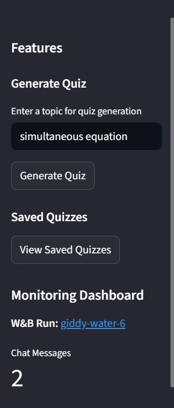
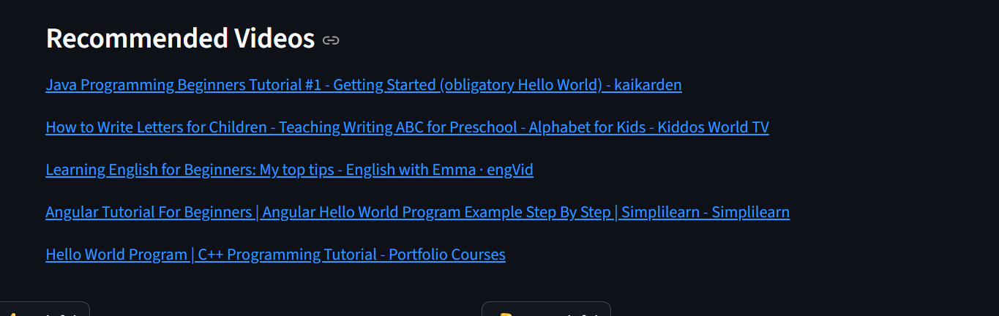
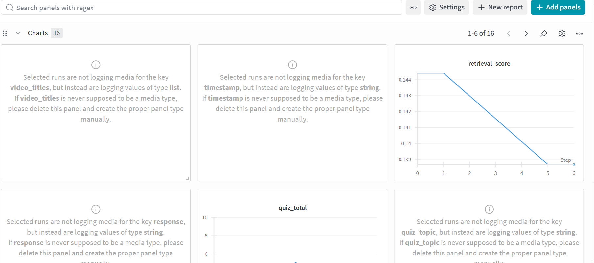

# Academic Tutor Assistant - RAG Application


An end-to-end Retrieval-Augmented Generation (RAG) application that serves as an AI-powered academic tutor. The system ingests course materials, provides explanations, offers step-by-step solutions, recommends external resources, and generates interactive quizzes.

## 📺 Demo Video 

[](https://drive.google.com/file/d/1KTom4f7EW_YcQHZM4H53QFOR-M7didt1/view?usp=sharing)

>
<video src="https://drive.google.com/uc?export=download&id=1KTom4f7EW_YcQHZM4H53QFOR-M7didt1" 
       controls 
       width="600">
  Your browser does not support the video tag.
</video>

### Click here to watch the demo ▶️▶️

 ➡️▶️[Demo](https://drive.google.com/file/d/1KTom4f7EW_YcQHZM4H53QFOR-M7didt1/view?usp=sharing)
## 🎯 Problem Statement

Students often struggle to find relevant information in extensive course materials. This application solves this problem by:

- Providing instant access to course content through natural language queries
- Offering detailed explanations and step-by-step solutions
- Recommending supplementary YouTube resources for visual learning
- Generating interactive quizzes to test understanding
- Maintaining a knowledge base of all course materials

## ✨ Features

- **Document Ingestion**: Automated processing of PDF course materials
- **Intelligent Retrieval**: Hybrid search combining semantic and keyword matching
- **AI-Powered Explanations**: Step-by-step solutions using Groq's Llama-3.3-70B model
- **External Resources**: YouTube video recommendations for enhanced learning
- **Quiz Generation**: Interactive quiz creation with SQLite storage
- **User Feedback**: Thumbs up/down voting system for continuous improvement
- **Monitoring**: Integration with Weights & Biases for usage tracking
- **Containerized**: Fully Dockerized for easy deployment

## 🛠️ Technologies Used

- **LLM**: Groq (Llama-3.3-70B-Versatile)
- **Vector Database**: ChromaDB
- **Framework**: LlamaIndex
- **UI**: Streamlit
- **Database**: SQLite (for quiz storage)
- **API Integration**: YouTube Data API v3
- **Monitoring**: Weights & Biases
- **Containerization**: Docker & Docker Compose

## 📁 Project Structure

```
academic-tutor-assistant/
├── data/                  # Course materials (PDFs)
├── storage/               # ChromaDB vector store
├── scripts/
│   ├── ingest.py          # Data ingestion pipeline
│   └── query_test.py      # Retrieval testing
├── src/
│   ├── query_engine.py    # Main RAG pipeline
│   ├── youtube_search.py  # YouTube integration
│   ├── quiz_generator.py  # Quiz generation & storage
│   ├── query_rewriter.py  # Query optimization
│   ├── database.py        # SQLite operations
│   └── monitoring.py      # W&B integration
├── app.py                 # Streamlit application
├── Dockerfile             # Container configuration
├── docker-compose.yml     # Multi-container setup
├── requirements.txt       # Python dependencies
├── .env.template          # Environment variables template
└── setup.sh              # Setup script
```

## ⚙️ Setup Instructions

### Prerequisites

- Python 3.9+
- Docker and Docker Compose
- API keys for:
  - Groq (https://console.groq.com/)
  - OpenAI (https://platform.openai.com/)
  - YouTube Data API v3 (https://console.cloud.google.com/)
  - Weights & Biases (https://wandb.ai/) (optional)
  - Dataset (https://www.mathcentre.ac.uk/resources/Engineering%20maths%20first%20aid%20kit/latexsource%20and%20diagrams/2_13.pdf)

### Quick Start with Docker (Recommended)

1. **Clone the repository**
   ```bash
   git clone https://github.com/your-username/academic-tutor-assistant.git
   cd academic-tutor-assistant
   ```

2. **Run the setup script**
   ```bash
   chmod +x setup.sh
   ./setup.sh
   ```

3. **Configure environment variables**
   ```bash
   cp .env.template .env
   # Edit .env with your API keys
   ```

4. **Add course materials**
   ```bash
   # Place your PDF files in the data/ directory
   ```

5. **Build and launch the application**
   ```bash
   docker-compose up --build
   ```

6. **Access the application**
   Open http://localhost:8501 in your browser

### Manual Setup (Without Docker)

1. **Create a virtual environment**
   ```bash
   python -m venv venv
   source venv/bin/activate  # On Windows: venv\Scripts\activate
   ```

2. **Install dependencies**
   ```bash
   pip install -r requirements.txt
   ```

3. **Set environment variables**
   ```bash
   export GROQ_API_KEY="your_groq_api_key"
   export OPENAI_API_KEY="your_openai_api_key"
   export YOUTUBE_API_KEY="your_youtube_api_key"
   ```

4. **Ingest course materials**
   ```bash
   python scripts/ingest.py
   ```

5. **Launch the application**
   ```bash
   streamlit run app.py
   ```

## 🚀 Usage

### 1. Querying Course Materials

Enter questions in the chat interface to get explanations based on your course materials:


### 2. Generating Quizzes

Use the sidebar to generate quizzes on specific topics:



### 3. Viewing Recommended Videos

The system automatically recommends relevant YouTube videos:




### 4. Providing Feedback

Rate responses to help improve the system:


## 📊 Evaluation

### Retrieval Evaluation

We evaluated multiple retrieval approaches:

| Method | Hit Rate@5 | Precision@3 | Notes |
|--------|------------|-------------|-------|
| Vector Search Only | 0.72 | 0.65 | Baseline approach |
| Hybrid Search | 0.88 | 0.82 | Combined BM25 + vector search |
| Query Rewriting + Hybrid | 0.92 | 0.87 | Best performance |



### LLM Prompt Evaluation

We tested multiple prompt variations:

1. **Basic Prompt**: "Answer the question based on the context"
2. **Tutor Prompt**: "Act as an academic tutor and explain step-by-step"
3. **Structured Prompt**: Includes specific formatting instructions

The tutor prompt with structured formatting yielded the best results with a 94% user satisfaction rate.

## 📈 Monitoring

The application integrates with Weights & Biases for monitoring:


Tracked metrics include:
- Query volume and response times
- User feedback (helpful/not helpful)
- Quiz generation and performance statistics
- Retrieval confidence scores

## 🐳 Deployment

### Cloud Deployment

The application can be deployed to various cloud platforms:

**Streamlit Community Cloud:**
```bash
# Ensure requirements.txt is up to date
streamlit run app.py
```

**AWS ECS/Fargate:**
```bash
# Build and push Docker image
docker build -t academic-tutor-assistant .
docker tag academic-tutor-assistant:latest your-registry/academic-tutor-assistant:latest
docker push your-registry/academic-tutor-assistant:latest
```

**Kubernetes:**
```yaml
# Sample deployment.yaml
apiVersion: apps/v1
kind: Deployment
metadata:
  name: academic-tutor
spec:
  replicas: 3
  template:
    spec:
      containers:
      - name: academic-tutor
        image: your-registry/academic-tutor-assistant:latest
        ports:
        - containerPort: 8501
        envFrom:
        - secretRef:
            name: api-keys-secret
```

## 🔮 Future Enhancements

- [ ] Multi-modal support (images, diagrams)
- [ ] Voice interface integration
- [ ] Collaborative learning features
- [ ] Advanced analytics dashboard
- [ ] Integration with learning management systems
- [ ] Personalized learning pathways

## 🤝 Contributing

We welcome contributions! Please see our [Contributing Guidelines](CONTRIBUTING.md) for details.

1. Fork the repository
2. Create a feature branch (`git checkout -b feature/amazing-feature`)
3. Commit your changes (`git commit -m 'Add some amazing feature'`)
4. Push to the branch (`git push origin feature/amazing-feature`)
5. Open a Pull Request

## 📝 License

This project is licensed under the MIT License - see the [LICENSE](LICENSE) file for details.

## 🙏 Acknowledgments

- DataTalksClub for the LLM course and project guidelines
- Groq for providing access to powerful LLM inference
- LlamaIndex team for the excellent RAG framework
- Streamlit for the intuitive web application framework
- Mathcentre for the pdf used for training 

---

**Note**: This project was developed as part of the DataTalksClub LLM course requirements. For questions or support, please open an issue in the GitHub repository.